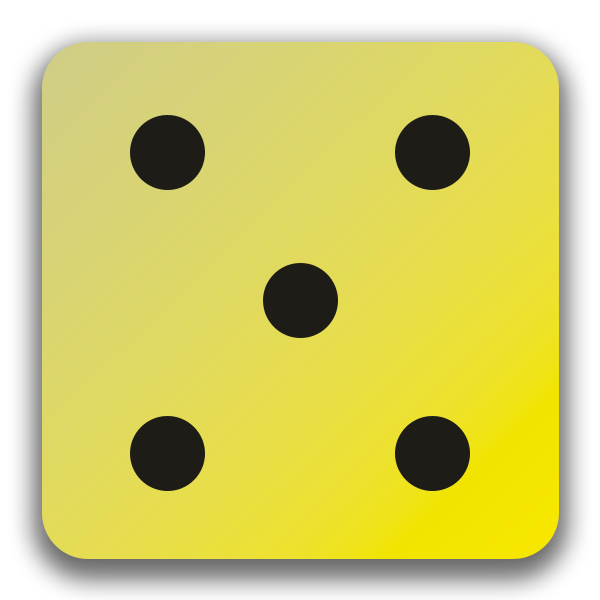

# 🎲 Flutter Dice Roller

A dynamic, interactive mobile application built with Flutter and Dart. This project was developed to master the transition from static UI to functional, state-driven applications.

## 🚀 Key Learning Milestones

### 🧠 Logic & State Management
- **StatefulWidgets**: Implemented the `StatefulWidget` lifecycle to allow the UI to react to user input.
- **setState()**: Used to trigger the Flutter build framework, ensuring the UI stays in sync with the underlying data.
- **Randomization**: Integrated `dart:math` to generate dynamic values for the dice rolls.

### 🏗️ Architecture & Widgets
- **Custom Widgets**: Refactored code into modular classes (`DiceRoller`, `GradientContainer`) to improve reusability and readability.
- **The Widget Tree**: Deep understanding of nesting `MaterialApp` -> `Scaffold` -> `Container` -> `Column`.
- **Layouts**: Mastered `MainAxisSize.min` and `SizedBox` for precise vertical and horizontal alignment.

### 🧬 Dart Fundamentals
- **Constructors**: Utilized `super.key` and `this.variable` shortcuts for efficient object initialization.
- **Functions as Values**: Passed functions to button `onPressed` listeners without immediate execution.
- **Final vs Const**: Applied memory-efficient practices by using `const` for compile-time constants.

## 🛠️ Built With
- **Flutter SDK**: Cross-platform UI toolkit.
- **Dart**: Strong-typed programming language.
- **Assets**: Custom image integration registered via `pubspec.yaml`.

## 📸 Preview
| Roll 1 | Roll 2 |
| :---: | :---: |
|  |  |

---
*Developed as part of my professional Flutter development journey.*